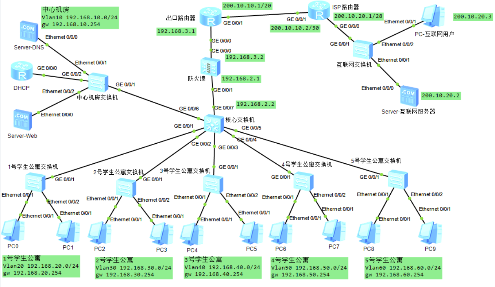
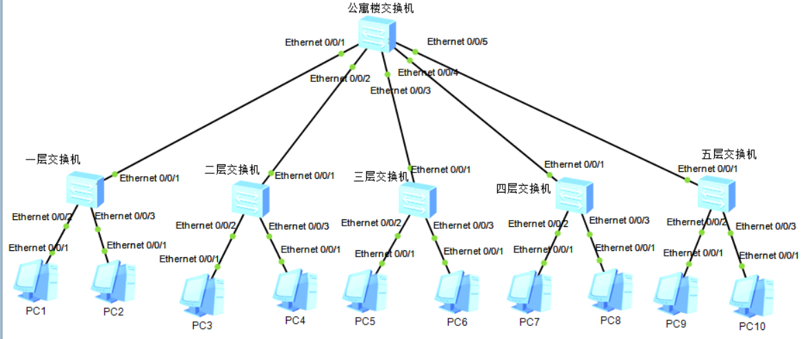

# 介绍

>本仓库提供计算机网络ensp程序制作校园规划的文件
>
>网络规划和楼层项目为ensp文件，配置文件夹文件可在打开ensp后导入
>
>方便计算机网络课设制作参考，希望对大家有所帮助
>
>欢迎大家关注我的其他仓库
>

[点击此处下载程序和文件](https://github.com/WorldDawnAres/internet_keshe/releases)

>总设网络计图如下

>
>公寓网设计如下

>设计参考如下

[ensp DHCP以及DHCP中继的配置](https://blog.csdn.net/qq_45631844/article/details/109017637)

[csdn课设文档参考](https://blog.csdn.net/weixin_46274254/article/details/125522333)
